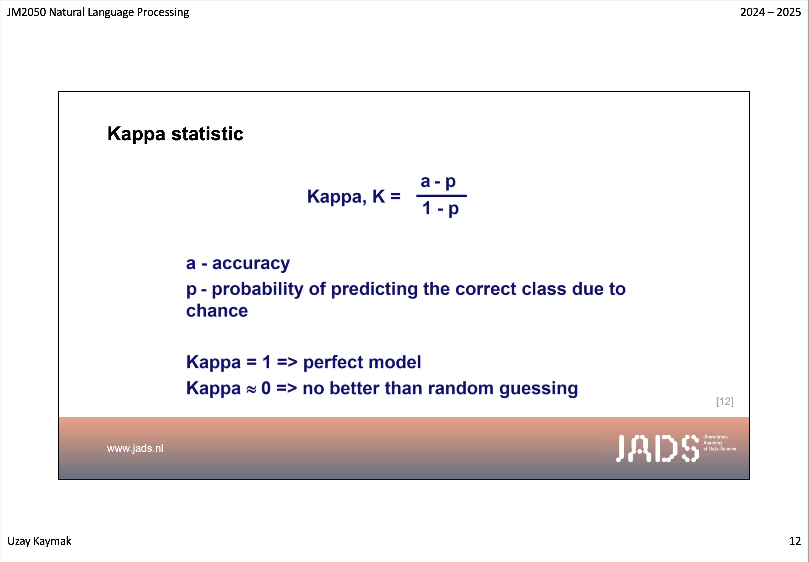

# Our Improvement
Playing around with the framework we quickly realized that its not ideal for our course material. There are several problems that we identified:
- **Graphs** don't contain text, but have a meaning 
- **Diagrams** are especially important for understanding the structure of a certain architecture
- **Formulas** are important but the text extraction doesnt really work
- **Images** some slides contain text but its saved as an image

We therefore wanted to improve that by using a multimodal model that can interpret the slides in a better way. We used Gemini Flash for that. The model gets the whole PDF and the prompt to extract all the information of each slide. 
Even though this process takes longer on initialization, the quality of the extracted information is way better. 

Since "garbage in garbage out" is also true for RAGs, working on the information extraction seemed like an obvious choice to improve the Study Buddy.

We will elaborate on the problem and our solution in the following sections.


## Problem Example 
We experimented with this slide:


Extraction using `PyPDFLoader` (from `langchain_community.document_loaders`)
```
JM2050 Natural Language Processing 2024 –2025
Uzay Kaymak 12
www.jads.nl
Kappa statistic
[12]
```

The result is missing all the important information since it is not actually text but an image. So the next step is to enable the image extraction. This leads to the following output:

```
JM2050 Natural Language Processing 2024 –2025
Uzay Kaymak 12
www.jads.nl
Kappa statistic
[12]JADS
Jheronimus
Academy
of Data Sciencea-p
Kappa,K =
1-p
a-accuracy
p -probability of predicting the correct class due to
chance
Kappa = 1 => perfect model
Kappa ~ 0 => no better than random guessing
```

The result is already better, but important things like the formula are still wrongly interpreted. 

Furthermore there is a lot of unnecessary text like the course information and the website.

## Our Solution
We decided to use the benefits from a multi-modal model that can interpret the slides in a better way. We used Gemini Flash for that. The model gets the whole PDF and the prompt to extract all the information of each slide. Furthermore if there are visualizations or code snippets, it should also extract them and explain them. So that we can use the extracted information as our document. So later on we can also ask questions about the slides and get the answers from the rag.

This is the prompt we used:
```
Please extract all the content from the slides attached, make it very extensive, only repeat information that is in the slides. If there are code snippets summarize them and mention the intention. If there is a visualization please describe it in text form as well. Avoid unnecessary repetition like common logos or names that appear on almost every slide.
Structure your output like this: 
Slide [page number range]: [Content]

Slide [page number range]: [Content]
```

This lead to the following output for the slide above (after automatic processing the output, like extracting the slide number):

```
Kappa statistic. Formula: Kappa, K = (a-p)/(1-p), where a = accuracy and p = probability of predicting the correct class due to chance. Kappa = 1 => perfect model, Kappa ≈ 0 => no better than random guessing.
```

So indeed this approach was able to extract the formula and all the important information from the slide.

## Implementation Considerations
Our loader uses the Gemini API, it still was able to process all the slides (1110) in roughly 15 minutes. This is of course way slower than the PyPDFLoader, but the quality of the extracted information is way better, and since the slides are only processed once, the time is still acceptable.

Regarding the price we were using the free Gemini API. For the amount of slides we were processing that was still possible, but even if we would have needed to pay for the API the price for processing 1000 PDF slides on VertexAI would have been only 2ct. Also in that regard paying this price once to have a better quality of the extracted information is worth it.

## Technical Details
The loader uses the `google.generativeai` package to interact with the Gemini API. To work the API key needs to be set in the environment variable `GOOGLE_API_KEY`. 

Since we also used the Cloud Interface we then also used Gemini to interact with our RAG. For this we changed this in the `.env`
```
use_gemini=True
gemini_model_name='gemini-1.5-flash'
```
Langchain also expects the `GOOGLE_API_KEY` to be set in the environment variable, so that worked well together.