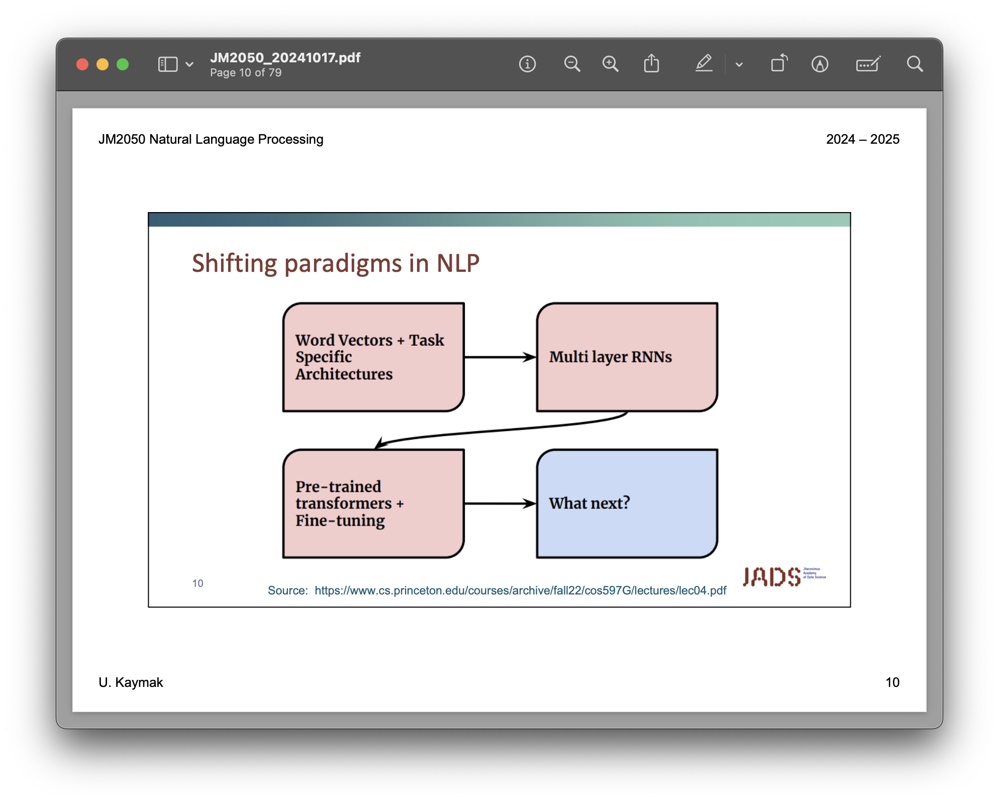
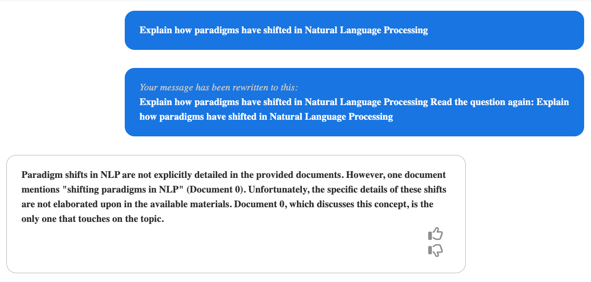
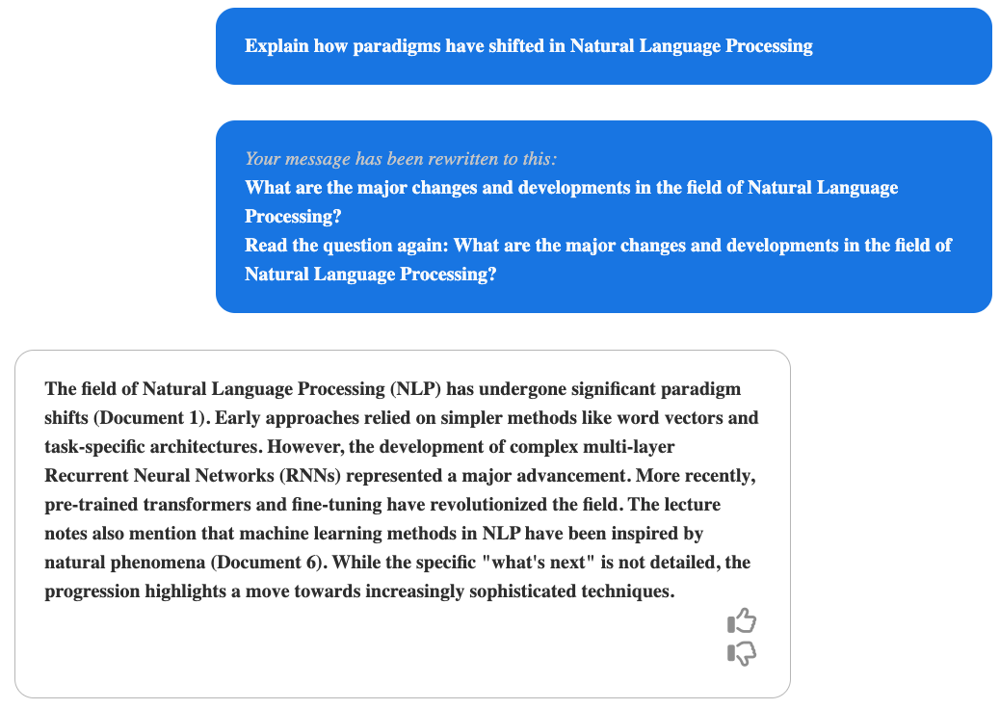

# 📚 Study Buddy 🤖

>👋 Welcome to our report!
> In the following we describe our thinking process behind the improvement we provided for [RAGMeUp](https://github.com/AI-Commandos/RAGMeUp) by Understandling.
>
> **Authors:**
> 
> Roman Nekrasov
> 
> Andy Huang
> 
> Huub Van de Voort

## Our Thinking Process
To start, we really enjoyed the lectures and the assignments for the course Natural Language Processing (JM2050). Our participation in lectures also inspired the solution we developed. 

As E. Tromp briefly already mentioned during the sessions, his lecture materials do not contain much text per slide and this might become an obstacle when incorporating those materials in a Retrieval Augmented Generation (RAG) system. After further investigation we also noticed that the lecture slides of Prof. U. Kaymak also contain many images which highly contribute to the understanding of the course but are not taking into consideration by the AS-IS version of [RAGMeUp](https://github.com/AI-Commandos/RAGMeUp).

To illustrate this issue more concretely, consider the following slide:

    

The slide contains much information about the evolution of Natural Language Processing Techniques (NLP). However, all information is captured within an image and for that reason it is not incorporated in the database of the RAG system. If we ask [RAGMeUp](https://github.com/AI-Commandos/RAGMeUp) a question about this slide it provides us with the following answer:

    

To us the lecture materials are very informative, however, [RAGMeUp](https://github.com/AI-Commandos/RAGMeUp) is unable to extract as much information from them as we can. So we started to look for solutions to overcome this problem.

During our studying efforts we often use Multimodal Language Models to support us when interpreting images on slides and we are very satisfied with their ability to do so. For example, if we prompt [Google Gemini](https://gemini.google.com/) to provide us with an explanation of the same slide as we discussed earlier we end up with the following response:

>Certainly, let's break down the slide titled "Shifting Paradigms in NLP" from the JM2050 Natural Language Processing course.
>
>**Overall Theme:**
>
>The slide illustrates the evolution of Natural Language Processing (NLP) techniques, highlighting the shift from earlier approaches to more recent, powerful methods.
>
>**Key Paradigms:**
>
>1. **Word Vectors + Task-Specific Architectures:**
>
>   - This represents the traditional approach where words are represented as numerical vectors (embeddings) and then fed into specific neural network architectures designed for particular NLP tasks like sentiment analysis or machine translation.
>
>2. **Multi-layer Recurrent Neural Networks (RNNs):**
>
>   - RNNs were a significant advancement, enabling the processing of sequential data like text. They could capture dependencies between words in a sentence, making them suitable for tasks like language modeling and text generation. However, RNNs suffered from vanishing gradient problems, limiting their effectiveness with long sequences.
>
>3. **Pre-trained Transformers + Fine-tuning:**
>
>   - This is the current state-of-the-art in NLP. Pre-trained transformer models like BERT and GPT-3 are trained on massive amounts of text data to learn rich representations of language. These models can then be fine-tuned on specific tasks with relatively small amounts of data, leading to impressive performance gains.
>
>4. **What Next?:**
>
>   - This open-ended question points to the ongoing research and development in NLP. The field is constantly evolving, and we can expect even more powerful and sophisticated techniques to emerge in the future.
>
>**In Summary:**
>
>The slide demonstrates the progression from simpler, task-specific models to more powerful, general-purpose models capable of handling a wide range of NLP tasks with high accuracy. The current paradigm of pre-trained transformers and fine-tuning has revolutionized the field, and we eagerly anticipate the next breakthroughs in NLP.
>
>Let me know if you would like to delve into any specific aspect of the slide in more detail!

This answer is by far much more valuable than the one by the RAG system and made us wonder, can we integrate this ability in a RAG system somehow?

---

## Design Decisions
After further investigation of potential solutions to our problem we found a [blog post by LangChain](https://blog.langchain.dev/multi-modal-rag-template/) which discusses the use of Multi Modal RAG on slide decks. The post discusses two approaches for this purpose, both of which first transform slides to images. In the first approach, for each image a multimodal embeddings is created and the complete image is retrieved and loaded into the prompt for user question answering. In the second approach, the LLM creates a summary for each image and for this summary and embedding is created. For question answering, the users question is compared to the summary in order to incorporate the associated image in the prompt. The evaluation shows that providing both the image and the summary with the prompt yields significant improvements over text only RAG.

In our implementation, we leveraged the large context window of Google Gemini to provide a comprehensive summary of the complete slide deck by providing the complete slide deck as an input. We decided on this approach instead of iteratively generating a summary by inserting the slides one by one, saving the number of calls to the API while maintaining enough detail in the summary.

When we ask the improved system the same question as earlier in this document, this answer is significantly better than the initial one.

    

---

## Evaluation

In the following table, we list a set of manually formulated questions related to the course content. For each question we indicated which of the three approaches provided the correct answer. Based on this evaluation we see that the summary approach provides in the majority of the cases the correct answer.

We also used [Docling](https://ds4sd.github.io/docling/) for this comparison. Docling is an advanced document parser. We wanted to see how an advanced parsing method would compare to our approach. We hypothesised that the slide summary approach would still work better because Docling is still limited to parsing without surrounding context.

|Question number| Question                                                                                                                                                                         | Standard | Summary | Docling |
|---------------|----------------------------------------------------------------------------------------------------------------------------------------------------------------------------------|----------|---------|---------|
|2              | What is the approach for self-consistency sampling?                                                                                                                              | 0        | 1       | 0       |
|3              | What are Chain of Thought triples?                                                                                                                                               | 0        | 1       | 0       |
|4              | Compare the formatting of a traditional few-shot prompt to a chain of thought prompt by an example.                                                                              | 1        | 0       | 1       |
|5              | What do the authors of "Rethinking the role of demonstrations: What makes in-context learning work?" mean with gold labels and random labels?                                    | 0        | 0       | 0       |
|6              | What are the four elements of a prompt?                                                                                                                                          | 0        | 0       | 0       |
|7              | Explain the language model landscape pre GPT-3.                                                                                                                                  | 0        | 1       | 1       |
|8              | Explain how paradigms shift in Natural Language Processing.                                                                                                                      | 0        | 1       | 1       |
|9              | What is the 20 Questions game, and how does it relate to concepts in natural language processing?                                                                                | 0        | 0       | 0       |
|10             | Explain the trade-off between interpretability vs. predictive value in topic modelling by providing a use case which tries to tackle this trade-off.                             | 1        | 1       | 1       |
|11             | My professor asked the following philosophical question: "What is a topic?" What is the answer to this question?                                                                 | 0        | 1       | 0       |
|13             | If I would reduce the dimensionality of embeddings and then plot them on a 2D plot and visualize the produced clusters of K-Means and HDBSCAN, how would the plots be different? | 0        | 0       | 1       |
|14             | Explain the meaning of each of the produced matrices in singular value decomposition.                                                                                            | 1        | 1       | 1       |
|15             | How did my professor explain the applications of topic models in relation to academic journals archives?                                                                         | 0        | 1       | 0       |
|16             | What are typical features in NER?                                                                                                                                                | 0        | 1       | 0       |
|17             | Provide the overview of text analysis techniques as in the research by Banks et al., 2018.                                                                                       | 0        | 0       | 0       |
|19             | Explain how the error curves for the training and holdout data relate to each other in the sweet spot.                                                                           | 0        | 0       | 0       |
|20             | Explain the progression of the error curves for the training and holdout data when a model is generalising well.                                                                 | 0        | 0       | 0       |
|22             | Explain the shape and implications of the kappa curve in a kappa curve plot.                                                                                                     | 0        | 0       | 0       |
|23             | What are the steps in RLHF and InstructGPT?                                                                                                                                      | 0        | 1       | 1       |
|24             | Compare auto-encoders to word2vec.                                                                                                                                               | 0        | 1       | 0       |
|25             | What is remarkable when it comes to the model architecture of an auto-encoder?                                                                                                   | 0        | 1       | 0       |
|               | **Total**                                                                                                                                                                        | **3**    | **12**  | **7**   |

For completeness, we will add the screenshots of the responses of the RAG system as an attachment to the submission. 

---

## Technical Details

### Requirements

Our improvement reders `.pdf` documents as images with the Python package [pdf2image](https://pypi.org/project/pdf2image/) which requires `poppler` for rendering `.pdf` documents as images. For details on how to install this library on your OS, please visit the [pipy page of pdf2image](https://pypi.org/project/pdf2image/). 

### General
In the file `SlideDeckSummarizer.py` we created a class named `SlideDeckSummarizer` which does the following:
1. It first identifies which `.pdf` documents are likely to be slide decks. This is done calculating the average words per line for each page and then comparing this against a threshold. The rationale behind it is that documents that are not slide decks contain more words per line on average. When the majority of the pages in the document are likely to be slides, the whole document is classified as a slide deck.
2. After classification, the slide decks are converted to `.jpeg` format and stored on disk in order to prevent memory issues.
3. Then, all rendered images are inserted into a prompt to Google Gemini and the corresponding `.pdf` document is replaced by a `.txt` file containing a per-slide summary of both the textual and visual elements in the input folder.

The functionalities of the class are consolidated in the public method `SlideDeckSummarizer.SlidedeckSummarizer.transform_slidedecks_and_remove_pdf`. In the `.env` we defined a switch for turning the summarizer on. When switched on, the summarizer is triggered when RAGHelperCloud is initialized.

---

## Limitations
If we could further improve this work we would decouple the LLM used for generating summaries for a slide deck from the LLM used for user questions answering. This would broaden the usability of the solution since then any LLM can be used for the question answering task. Next, we would integrate the same methodology for `.pptx` files and extent the functionality for added documents while the backend is running.
Finally, as we learned about position bias of LLMs we would further investigate if creating a slide summary iteratively results in a more qualitative summary than including all images into a single prompt.

