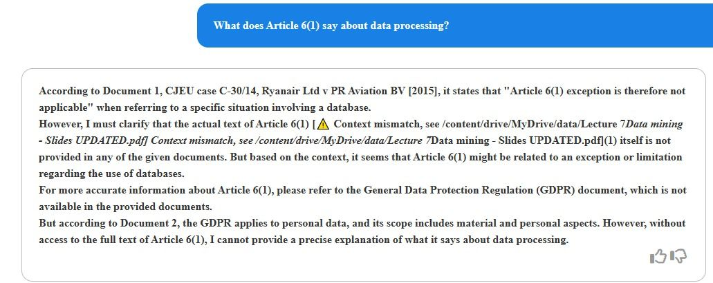
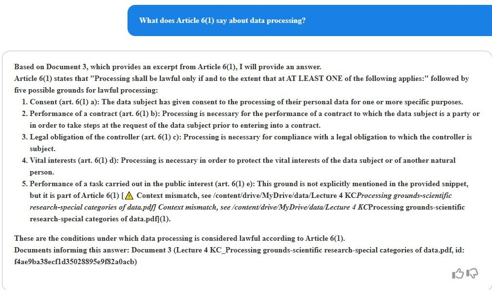

# Hybrid Citation-Aware Reranking & Citation Verification for RAG Me Up

## Introduction: Enhancing Course Material Understanding

This pull request improves the RAG Me Up framework to create an intelligent study companion for the Intellectual Property & Privacy (IPP) course materials. By improving citation handling and verification, we aim to help students better understand and navigate complex legal concepts in the course content.

Through our proposed improvement of the RagMeUp framework, students can ask detailed questions about course materials, such as "What does Article 6(1) say about data processing?" and receive accurate, well-referenced responses that maintain proper context and attribution to the source materials.

## Use Case: Intellectual Property & Privacy Documentation

In the domain of legal and regulatory documentation, particularly when dealing with Intellectual Property and Privacy course materials, accurate handling of citations and references is of high importance. This pull request introduces significant improvements to how RAG Me Up processes and verifies citations within these study materials .

Our focus has been on improving interpretation of legal texts, including processing requirements, GDPR article interpretations, and regulatory frameworks. The system has been designed to handle  queries that require accurate citation understanding, such as investigating specific GDPR articles or exploring relationships between different regulations covered in the course.

## The Challenge of Legal Document Processing

Traditional RAG systems often struggle with the complexity of legal documents. They may retrieve semantically similar passages without properly considering the specific articles being referenced, or worse, generate responses that incorrectly cite non-existent articles. The context surrounding citations is frequently lost in the retrieval process, and the intricate relationships between different articles are not properly maintained.

To illustrate these challenges and our solution, consider our example query "What does Article 6(1) say about data processing?" The screenshots below demonstrate how our improved system handles this:


*Image 1: Response with the original RAG framework


*Image 2: Response showing context mismatch detection and proper citation handling with source verification*

Our implementation provides comprehensive citation handling, including clear verification of references, explicit marking of context mismatches, and proper source attribution. in cases where the complete article text isn't directly available, the system maintains accuracy by clearly indicating limitations and verification status. Our approach consists of 2 solutions

## Hybrid Citation-Aware Reranking

Our implementation uses a hybrid approach that combines semantic understanding with citation awareness. This hybrid method enhances traditional semantic search with citation-specific information, providing more accurate and contextually relevant results for legal document queries.

The system considers semantic relevance and citation accuracy, weighing both factors to produce optimal rankings. This approach proves particularly effective for course material queries where both topical relevance and precise citation handling are crucial.

## Implementation

### 1. CitationAwareReranker

Our hybrid approach combines three elements: semantic similarity, citation matching, and contextual relevance. Each component plays a role in ensuring accurate document retrieval.

#### Components of Citation Score

The citation scoring process has been designed to balance multiple factors, which weights can be customized in the .env

First, the exact match scoring mechanism accounts for 40% of the citation score:
```python
exact_match = 1.0 if qc.lower() == dc.lower() else 0.0
```
This ensures that direct references to specific articles receive appropriate weight in the ranking process. The matching is case-insensitive to accommodate various citation styles while maintaining accuracy.

The second component introduces context similarity scoring, weighted at 30%:
```python
context_similarity = self.model.predict([
    query_citation_context,
    doc_citation_context
])
```
This aspect evaluates how citations are used within their surrounding text, allowing the system to identify proper citation usage, even when the phrasing differs from the original source. We utilize the cross-encoder/ms-marco-MiniLM-L-6-v2 model for semantic comparison.

The third component, proximity scoring (30%), examines the relationship between citations and query-relevant content:
```python
proximity_score = self._calculate_proximity_score(dc, doc_content, query)
```
This helps ensure that retrieved passages not only contain the right citations but use them in relevant contexts. The proximity calculation considers both physical distance in the text and semantic relevance to the query.

#### Final Score Calculation

The system combines individual citation scores using a weighted approach that balances breadth and depth:
```python
avg_score = sum(citation_scores) / len(citation_scores)
max_score = max(citation_scores)
final_score = avg_score * 0.7 + max_score * 0.3
```

This formula gives precedence to consistent performance across multiple citations (70%) while still rewarding strong individual matches (30%). This balance helps prevent situations where a single strong match might overshadow overall relevance. This final score is assigned to relevance score. 

### 2. ResponseCitationVerifier

The ResponseCitationVerifier represents an imrpovement in ensuring the accuracy of citations in LLM responses. This component implements a comprehensive verification system that examines both the presence and proper usage of citations.

#### Citation Detection and Context Analysis

We use pattern matching to identify citations while preserving their surrounding context:
```python
def _extract_citations(self, text: str) -> List[ResponseCitation]:
    citations = []
    for pattern in compiled_patterns:
        for match in pattern.finditer(text):
            start, end = match.span()
            context_start = max(0, start - self.context_window)
            context_end = min(len(text), end + self.context_window)
            
            main_num = match.group(1)
            sub_num = match.group(2) if len(match.groups()) > 1 else ""
            reference = main_num + (f"({sub_num})" if sub_num else "")
            
            citations.append(ResponseCitation(
                text=match.group(0),
                reference=reference,
                context=text[context_start:context_end],
                span=(start, end)
            ))
```

This approach captures not just the citations themselves but also their usage context, enabling more accurate verification. The system handles various citation formats and maintains position information for precise response modification.

#### Verification Process

The verification process employs semantic comparison to ensure citations are used appropriately:
```python
def _find_best_context_match(self, citation: ResponseCitation, matches: List[Dict]) -> Dict:
    scores = []
    for match in matches:
        score = self.model.predict([
            citation.context,
            match['context']
        ])
        scores.append({
            'score': score,
            'source': match['source'],
            'context': match['context']
        })
    return max(scores, key=lambda x: x['score'])
```

Through this process, the system not only verifies the existence of cited articles but also ensures they are used in the proper context. The verification includes semantic similarity checking between the citation context in the response and the original source material.

#### Response Enhancement

The system provides visual indicators of citation validity through three distinct markings:

For valid citations that are properly used:
```text
Article 6(1) [source.pdf]
```

For citations used in incorrect contexts:
```text
Article 6(1) [⚠️ Context mismatch, see source.pdf]
```

For invalid or hallucinated citations:
```text
⚠️ [Invalid citation: Article 6(1)]
```

## Configuration and Implementation

The system's behavior can be finely tuned through a set of new configuration parameters:

```env
# Citation Aware Reranking
citation_weight=0.3                    # Weight between semantic and citation scores
citation_exact_match_weight=0.4        # Weight for exact citation matches
citation_context_weight=0.3            # Weight for context similarity
citation_proximity_weight=0.3          # Weight for proximity scoring
vector_store_k=10                      # Number of documents to retrieve
rerank_k=5                            # Number of documents after reranking

# Context Windows
citation_context_window=200            # Characters before/after citation for context

# Verification
citation_verification=True             # Enable verification system
citation_similarity_threshold=0.7      # Threshold for context matching
```

## Technical Requirements

The implementation relies on several key Python libraries:
- sentence-transformers for semantic similarity calculations
- langchain-core as the base RAG framework
- re for pattern matching and citation detection
- os for environment variable management

To implement these improvements, follow these steps:

1. Install the required dependencies:
```bash
pip install sentence-transformers
```

2. Configure the environment by updating your .env file with the appropriate parameters as shown in the configuration section above.

3. The new components will be automatically integrated into your existing RAG pipeline when enabled.

## Future Developments

Our roadmap for future improvements focuses on two main areas:

The first priority is the integration of semantic chunking capabilities. The current implementation, while effective, uses basic chunking methods that can occasionally split citations across chunks. We've tried integrating the Semantic Chunker, but had several problems with its implementation (as tracked in langchain-ai/langchain#26221). Due to time constraints we were not able to fix this, which led into using the default chunking methods.

The second area of focus, is a more improved citation understanding through several improvement techniques, by means of building support for hierarchical citation validation. We would also like to explore integration with legal document ontologies and citation graph analysis to better understand relationships between different articles and sections.

One key point which we did not fix, but we are aware of, is the dependency of the provenance with method set to reranking. Our new reranker uses a combined score, which is passed to the metadata to be able to maintain the inner workings of the provenance. We did not further investigate the provenance functionalities for our improvements.

These improvements will improve the system's ability to handle complex legal documentation while maintaining high accuracy in citation handling and verification, making it an even more effective study companion for the IPP course.

